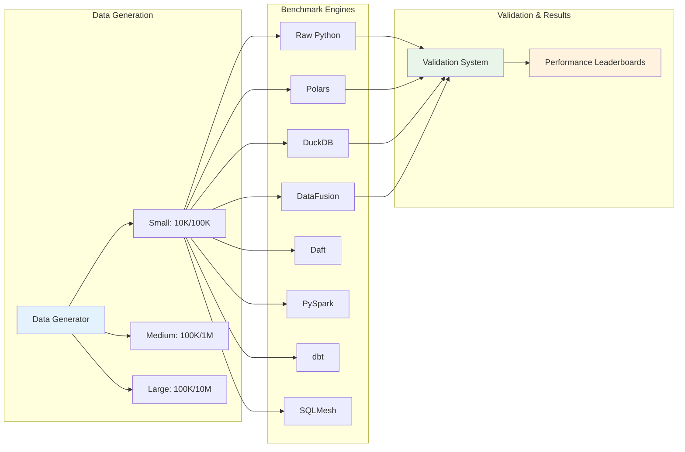
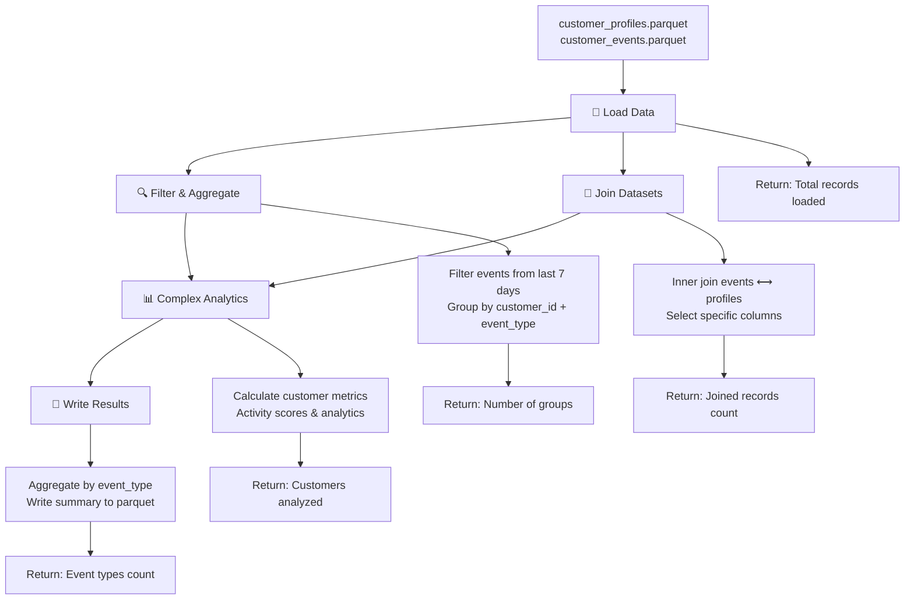

# Data Processing Engine Benchmarks

A comprehensive comparison of modern data processing engines, showcasing both performance characteristics and coding approaches for identical analytical workloads.

[](https://python.org)
[](LICENSE)
[](#engines-tested)

## 🎯 Overview

This project provides **fair, standardized comparisons** of popular data processing engines using realistic customer analytics workloads. Beyond performance metrics, it showcases **different coding styles, paradigms, and approaches** to solving identical data problems. Unlike other benchmarks that may use different operations per engine, our suite ensures **identical transformations** across all engines, allowing you to compare both performance and code elegance.
### Key Features

- **🔄 Standardized Operations**: All engines perform identical data transformations
- **� Cuode Style Comparison**: Compare different programming paradigms and syntax approaches
- **📊 Multi-Scale Testing**: Small (10K/100K), Medium (100K/1M), Large (100K/10M) datasets
- **✅ Validated Results**: Automated verification ensures all engines produce identical outputs
- **� Caomprehensive Metrics**: Execution time, memory usage, and CPU utilization
- **🎨 Implementation Showcase**: See how different engines approach the same problems
- **🚀 Easy Setup**: Automated data generation and dependency management

## 🏗️ Architecture



## 🚀 Quick Start

### Prerequisites

- Python 3.11+
- 4GB+ RAM (for large datasets)
- 2GB+ disk space

### Installation

```bash
# Clone the repository
git clone https://github.com/data-engineering-helpers/benchmark-processing-engines.git
cd benchmark-processing-engines

# Install dependencies
cd benchmarks
pip install -r requirements.txt

# Run benchmarks (data is generated automatically)
python run_all_benchmarks.py small
```

### Basic Usage

```bash
# Run all engines on small dataset
python run_all_benchmarks.py small

# Run specific engines
python run_all_benchmarks.py medium polars duckdb datafusion

# Compare across all scales
python run_all_benchmarks.py --all-scales duckdb

# Validate engine correctness
python validate_results.py small
```

## 🏁 Benchmark Results

### Performance Leaderboard (Small Scale: 10K profiles, 100K events)

| Rank | Engine | Avg Time | Memory | Best At |
|------|--------|----------|--------|---------|
| 🥇 | **DataFusion** | 0.009s | 14.5MB | Load Data, Complex Analytics |
| 🥈 | **Polars** | 0.014s | 23.9MB | Filter & Aggregate, Write Results |
| 🥉 | **DuckDB** | 0.031s | 8.0MB | Join Datasets |
| 4th | **Daft** | TBD | TBD | Distributed Processing |
| 5th | **PySpark** | TBD | TBD | Large Scale Processing |
| 6th | **Raw Python** | 0.060s | 39.6MB | Baseline Reference |

*Note: Performance benchmarks for Daft and PySpark are pending - engines are validated for correctness*

### Scaling Performance

| Engine | Small (10K/100K) | Medium (100K/1M) | Large (100K/10M) |
|--------|-------------------|------------------|-------------------|
| **DataFusion** | 0.009s | 0.086s | 0.385s |
| **Polars** | 0.014s | 0.126s | 1.332s |
| **DuckDB** | 0.031s | 0.226s | 0.694s |
| **Daft** | TBD | TBD | TBD |
| **PySpark** | TBD | TBD | TBD |
| **Raw Python** | 0.060s | 0.435s | ~2.1s* |

*Performance benchmarks pending for newly standardized engines

### Key Insights

**Performance:**
- **DataFusion** dominates across all scales with exceptional Arrow-based performance
- **DuckDB** excels at SQL operations and maintains good scaling characteristics  
- **Polars** shows excellent small-to-medium scale performance but faces memory pressure at large scale
- **Daft** and **PySpark** are now validated for correctness - performance benchmarks pending
- **Raw Python** provides a solid baseline but doesn't scale as efficiently

**Code Style & Usability:**
- **SQL-based engines** (DuckDB, DataFusion) offer familiar syntax for SQL developers
- **DataFrame engines** (Polars, Daft, Raw Python) provide intuitive method chaining for Python developers
- **Distributed engines** (PySpark, Daft) excel at large-scale processing with cluster capabilities
- **Polars** offers the most concise and readable functional-style code
- **DuckDB** provides the most powerful SQL features with CTEs and window functions
- **DataFusion** combines SQL familiarity with Arrow performance benefits
- **PySpark** provides mature distributed processing with extensive ecosystem support

## �  Code Style & Paradigm Comparison

One of the key values of this repository is comparing **how different engines approach identical problems**. Each implementation showcases distinct programming paradigms:

### Programming Approaches

| Engine | Paradigm | Code Style | Example |
|--------|----------|------------|---------|
| **Raw Python** | Imperative | Pandas DataFrame operations | `df.groupby(['customer_id', 'event_type']).agg(...)` |
| **Polars** | Functional | Method chaining with lazy evaluation | `df.group_by(['customer_id', 'event_type']).agg([...])` |
| **DuckDB** | Declarative | SQL with CTEs and window functions | `WITH recent_events AS (...) SELECT ... GROUP BY ...` |
| **DataFusion** | SQL + Rust | Arrow-native SQL execution | `ctx.sql("SELECT ... FROM ... WHERE ...")` |
| **Daft** | Distributed | Lazy distributed DataFrames | `df.groupby(...).agg(...).collect()` |
| **PySpark** | Distributed | RDD/DataFrame transformations | `df.groupBy(...).agg(...)` |
| **dbt** | Declarative | SQL with Jinja templating | `{{ ref('events') }} WHERE ...` |
| **SQLMesh** | Framework | SQL with Python orchestration | Model definitions with dependencies |

### Code Comparison Example

Here's how different engines implement the same "filter and aggregate" operation:

**Raw Python (Pandas)**:
```python
recent_events = events_df[events_df['event_timestamp_dt'] >= seven_days_ago]
result = recent_events.groupby(['customer_id', 'event_type']).agg({
    'event_id': 'count',
    'event_timestamp_dt': ['min', 'max']
}).reset_index()
```

**Polars**:
```python
result = events_df.filter(
    pl.col("event_timestamp_dt") >= seven_days_ago
).group_by(["customer_id", "event_type"]).agg([
    pl.col("event_id").count().alias("event_count"),
    pl.col("event_timestamp_dt").min().alias("min_timestamp")
])
```

**DuckDB**:
```sql
WITH recent_events AS (
    SELECT * FROM events
    WHERE TRY_STRPTIME(event_timestamp, '%Y-%m-%dT%H:%M:%S.%f') >= 
          (SELECT MAX(TRY_STRPTIME(event_timestamp, '%Y-%m-%dT%H:%M:%S.%f')) - INTERVAL 7 DAYS FROM events)
)
SELECT customer_id, event_type, COUNT(event_id) as event_count
FROM recent_events GROUP BY customer_id, event_type
```

**DataFusion**:
```python
result = ctx.sql("""
    WITH parsed_events AS (
        SELECT *, to_timestamp(event_timestamp) as event_ts FROM events
    )
    SELECT customer_id, event_type FROM parsed_events
    WHERE event_ts >= (SELECT MAX(event_ts) - INTERVAL '7' DAY FROM parsed_events)
""").collect()
```

**Daft**:
```python
# Uses pandas fallback for complex timestamp operations
events_pd = events_df.to_pandas()
events_pd['event_timestamp_dt'] = pd.to_datetime(events_pd['event_timestamp'])
recent_events_pd = events_pd[events_pd['event_timestamp_dt'] >= seven_days_ago]
result_pd = recent_events_pd.groupby(['customer_id', 'event_type']).agg({
    'event_id': 'count'
}).reset_index()
```

**PySpark**:
```python
events_with_ts = events_df.withColumn(
    "event_timestamp_dt", 
    coalesce(
        try_to_timestamp(col("event_timestamp"), lit("yyyy-MM-dd'T'HH:mm:ss.SSSSSS")),
        try_to_timestamp(col("event_timestamp"), lit("yyyy-MM-dd'T'HH:mm:ss"))
    )
)
result = events_with_ts.filter(col("event_timestamp_dt") >= lit(seven_days_ago)) \
    .groupBy("customer_id", "event_type").agg(count("event_id"))
```

This allows developers to:
- **Compare syntax preferences** (SQL vs DataFrame operations)
- **Evaluate code readability** and maintainability
- **Understand performance trade-offs** of different approaches
- **Choose the right tool** based on team expertise and preferences

## 🔧 Engines Tested

### ✅ Standardized & Validated

| Engine | Type | Description | Status |
|--------|------|-------------|--------|
| **Raw Python** | DataFrame | pandas-based reference implementation | ✅ Validated |
| **Polars** | DataFrame | Rust-based high-performance DataFrames | ✅ Validated |
| **DuckDB** | SQL Database | In-process analytical database | ✅ Validated |
| **DataFusion** | Query Engine | Apache Arrow's Rust query engine | ✅ Validated |
| **Daft** | DataFrame | Distributed multimodal DataFrames | ✅ Validated |
| **PySpark** | Distributed | Apache Spark for Python | ✅ Validated |

### 🔄 Being Standardized

| Engine | Type | Description | Status |
|--------|------|-------------|--------|
| **dbt** | Transformation | SQL-based data transformation | 🔄 In Progress |
| **SQLMesh** | Framework | Data transformation framework | 🔄 In Progress |

## 📋 Standard Operations

All engines perform identical operations for fair comparison:



## 📊 Data Schema

The benchmark uses realistic customer analytics data:

**Customer Profiles** (10K-100K records):
- `profile_id`, `email`, `email_status`
- `address` (JSON), `preferences` (JSON)

**Customer Events** (100K-10M records):
- `event_id`, `customer_id`, `event_type`
- `event_timestamp`, `source_system`, `event_data` (JSON)

## 🎛️ Advanced Usage

### Custom Benchmarks

```python
from benchmarks.benchmark_runner import BenchmarkRunner
from benchmarks.polars.benchmark import PolarsBenchmark

# Run custom benchmark
runner = BenchmarkRunner('medium')
benchmark = PolarsBenchmark('medium')

# Execute specific operations
load_time = runner.run_benchmark("polars", "load_data", benchmark.load_data)
```

### Adding New Engines

1. Create engine directory: `benchmarks/your_engine/`
2. Implement `benchmark.py` with standardized operations
3. Validate against reference: `python validate_results.py small`
4. Add to engine list in `run_all_benchmarks.py`

### Validation System

All engines are validated to produce identical results, ensuring fair performance comparisons:

```bash
# Validate all engines
python validate_results.py small

# Validate specific engines
python validate_results.py small raw_python polars daft pyspark

# Expected output for valid engines:
# ✅ load_data: 110000 (matches expected)
# ✅ filter_and_aggregate: 17676 (matches expected)
# ✅ join_datasets: 100000 (matches expected)
# ✅ complex_analytics: 10000 (matches expected)
# ✅ write_results: 4 (matches expected)
# 🎉 All engines validation PASSED!
```

**Recent Standardization Work:**
- **Daft**: Implemented pandas fallback for complex timestamp operations due to API limitations
- **PySpark**: Fixed timestamp parsing with `try_to_timestamp` and proper string literal handling
- **All Engines**: Standardized 7-day filtering, join operations, and analytics calculations

## 🤝 Contributing

We welcome contributions! Here's how to help:

1. **Add New Engines**: Implement standardized operations showcasing different programming paradigms
2. **Improve Code Style**: Enhance implementations to better demonstrate each engine's strengths and idioms
3. **Add New Operations**: Propose additional standardized analytical operations that highlight different approaches
4. **Code Examples**: Add more detailed code comparisons and explanations
5. **Documentation**: Improve documentation with focus on code style differences
6. **Bug Reports**: Report issues with validation or performance measurements

When contributing, focus on writing **idiomatic code** that showcases each engine's unique strengths and preferred patterns.

## 📈 Performance Notes

- **Memory measurements** are approximate and may vary by system
- **CPU usage** reflects utilization during benchmark execution
- **Results vary** based on hardware, OS, and system load
- **Large datasets** require sufficient RAM (4GB+ recommended)
- **PySpark** shows startup overhead but scales better with larger datasets

## 🔗 Related Projects

- [Data Engineering Helpers - Knowledge Sharing](https://github.com/data-engineering-helpers/ks-cheat-sheets)
- [Modern Data Stack (MDS) in a box](https://github.com/data-engineering-helpers/mds-in-a-box)
- [Data Engineering Architecture Principles](https://github.com/data-engineering-helpers/architecture-principles)

## References
* https://todomvc.com/
* [Data Engineering Helpers - Knowledge Sharing - Cheat sheets](https://github.com/data-engineering-helpers/ks-cheat-sheets)
  * [Data Engineering Helpers - Knowledge Sharing - Python](https://github.com/data-engineering-helpers/ks-cheat-sheets/tree/main/programming/python)
  * [Data Engineering Helpers - Knowledge Sharing - Spark](https://github.com/data-engineering-helpers/ks-cheat-sheets/blob/main/data-processing/spark/)
  * [Data Engineering Helpers - Knowledge Sharing - DuckDB](https://github.com/data-engineering-helpers/ks-cheat-sheets/blob/main/db/duckdb/)
  * [Data Engineering Helpers - Knowledge Sharing - SQLMesh](https://github.com/data-engineering-helpers/ks-cheat-sheets/blob/main/data-processing/sqlmesh/)
  * [Data Engineering Helpers - Knowledge Sharing - dbt](https://github.com/data-engineering-helpers/ks-cheat-sheets/blob/main/data-processing/dbt/)
* [Material for the Data platform - Architecture principles](https://github.com/data-engineering-helpers/architecture-principles)
* [Material for the Data platform - Modern Data Stack (MDS) in a box](https://github.com/data-engineering-helpers/mds-in-a-box/blob/main/README.md)
* [Material for the Data platform - Data life cycle](https://github.com/data-engineering-helpers/data-life-cycle)
* [Material for the Data platform - Data contracts](https://github.com/data-engineering-helpers/data-contracts)
* [Material for the Data platform - Metadata](https://github.com/data-engineering-helpers/metadata)
* [Material for the Data platform - Data quality](https://github.com/data-engineering-helpers/data-quality)


## 📄 License

This project is licensed under the MIT License - see the [LICENSE](LICENSE) file for details.

## 🙏 Acknowledgments

- Inspired by [TodoMVC](https://todomvc.com/) for standardized comparisons
- Built by the [Data Engineering Helpers](https://github.com/data-engineering-helpers) community
- Contributors speak on their personal behalf and do not represent their employers

---

