# Data Processing Engine Benchmarks

This benchmark suite compares the performance of different data processing engines on common analytical tasks using sample customer data.

## Architecture Overview


## Engines Tested

### ✅ Standardized Engines (Validated)
- **Raw Python** (pandas) - Traditional Python data processing
- **Polars** - Fast DataFrame library written in Rust  
- **DuckDB** - In-process analytical database
- **DataFusion** - Apache Arrow's query engine in Rust

### 🔄 Engines Being Standardized
- **Daft** - Distributed DataFrame library for multimodal data
- **PySpark** - Distributed computing framework
- **dbt** - Data transformation tool with SQL
- **SQLMesh** - Data transformation framework

> **Note**: Only the validated engines perform identical operations and produce comparable results. Other engines are being updated to match the standard operations.

## Benchmark Tasks

Each engine performs the same set of standardized tasks:

```mermaid
graph TD
    A[📁 Load Data] --> B[🔍 Filter & Aggregate]
    A --> C[🔗 Join Datasets]
    B --> D[📊 Complex Analytics]
    C --> D
    D --> E[💾 Write Results]
    
    A1[customer_profiles.parquet<br/>customer_events.parquet] --> A
    A --> A2[Return: Total records loaded<br/>profiles + events count]
    
    B --> B1[Filter events from last 7 days<br/>Group by customer_id + event_type<br/>Count events per group]
    B1 --> B2[Return: Number of groups]
    
    C --> C1[Inner join events ⟷ profiles<br/>ON customer_id = profile_id<br/>Select: event_id, customer_id, event_type, email_status]
    C1 --> C2[Return: Joined records count]
    
    D --> D1[Count total events per customer<br/>Count login events per customer<br/>Calculate activity_score = total_events × 0.9<br/>Join with profiles for email_status]
    D1 --> D2[Return: Customers with analytics]
    
    E --> E1[Group events by event_type<br/>Count per type<br/>Write to event_summary.parquet]
    E1 --> E2[Return: Number of event types]
    
    style A fill:#e1f5fe
    style B fill:#f3e5f5
    style C fill:#e8f5e8
    style D fill:#fff3e0
    style E fill:#fce4ec
```



### Task Details:

1. **Load Data** - Read parquet files into memory/engine
2. **Filter & Aggregate** - Filter events from last 7 days and group by customer_id + event_type
3. **Join Datasets** - Inner join customer profiles with events
4. **Complex Analytics** - Calculate customer activity metrics with standard assumptions
5. **Write Results** - Aggregate by event_type and export to parquet

## Setup

### 1. Install Dependencies
```bash
cd benchmarks
pip install -r requirements.txt
```

### 2. Data Generation
Data is automatically generated when you run benchmarks. The system will:
- Check if data exists for the requested scale
- Generate data only if it doesn't exist
- Store data in `data/{scale}/` directories

No manual data generation required!

### 3. Install Optional Engines
For dbt:
```bash
pip install dbt-core dbt-duckdb
```

For SQLMesh:
```bash
pip install sqlmesh
```

## Running Benchmarks

The benchmark system supports three data scales and automatically generates data if it doesn't exist:

### Data Scales
- **small**: 10,000 profiles, 100,000 events (~10MB)
- **medium**: 100,000 profiles, 1,000,000 events (~100MB) 
- **large**: 100,000 profiles, 10,000,000 events (~1GB)
- **xlarge**: 1,000,000 profiles, 100,000,000 events (~10GB)

### Run All Engines (Medium Scale - Default)
```bash
python run_all_benchmarks.py
```

### Run Specific Scale
```bash
python run_all_benchmarks.py small
python run_all_benchmarks.py medium  
python run_all_benchmarks.py large
python run_all_benchmarks.py xlarge
```

### Run Specific Engines and Scale
```bash
python run_all_benchmarks.py small polars duckdb datafusion
python run_all_benchmarks.py medium raw_python polars
python run_all_benchmarks.py large duckdb
python run_all_benchmarks.py xlarge datafusion
```

### Run All Scales for Specific Engines
```bash
python run_all_benchmarks.py --all-scales duckdb polars
```

### Run Individual Engine
```bash
cd raw_python
python benchmark.py small
python benchmark.py medium
python benchmark.py large
python benchmark.py xlarge
```

## Sample Output

```
================================================================================
COMPREHENSIVE BENCHMARK COMPARISON
================================================================================

============================================================
PERFORMANCE RESULTS FOR MEDIUM SCALE
============================================================

AVERAGE PERFORMANCE BY ENGINE (MEDIUM):
--------------------------------------------------
             execution_time  memory_usage_mb  cpu_percent
engine_name                                              
datafusion            0.089           50.2         18.9
polars                0.126           97.8          6.7
duckdb                0.226           55.9          8.7

BEST PERFORMER BY TASK (MEDIUM):
----------------------------------------
load_data            datafusion   (0.006s)
filter_and_aggregate polars       (0.103s)
join_datasets        duckdb       (0.019s)
complex_analytics    polars       (0.103s)
write_results        duckdb       (0.016s)
```

## Metrics Collected

- **Execution Time** - Wall clock time for each task
- **Memory Usage** - Peak memory consumption in MB
- **CPU Usage** - CPU utilization percentage
- **Success Rate** - Whether the task completed successfully

## Data Schema & Transformation Flow


### Input Data Schema

**Customer Profiles:**
- `profile_id` - Unique customer identifier
- `email` - Customer email address
- `email_status` - Email verification status (verified/pending/invalid)
- `address` - JSON object with address details
- `preferences` - JSON object with customer preferences

**Customer Events:**
- `event_id` - Unique event identifier
- `customer_id` - References profile_id
- `event_type` - Type of event (login, logout, profile_update, consent_update)
- `event_timestamp` - When the event occurred (ISO format)
- `source_system` - System that generated the event (web/mobile/api)
- `event_data` - JSON object with event-specific data

## Customization

### Adding New Engines
1. Create a new directory under `benchmarks/`
2. Implement a `benchmark.py` with a `run_benchmark()` function
3. Follow the same task structure as existing engines
4. Add to the engines list in `run_all_benchmarks.py`

### Adding New Tasks
1. Add task function to each engine's benchmark class
2. Update the `BENCHMARK_TASKS` list in `benchmark_runner.py`
3. Call the new task in each engine's `run_benchmark()` function

## Notes

- PySpark may show higher overhead due to JVM startup costs
- dbt and SQLMesh benchmarks measure CLI execution time
- Memory measurements are approximate and may vary by system
- Results will vary based on hardware and data size

## Troubleshooting

### Common Issues
- **Java not found**: Install Java 8+ for PySpark
- **dbt command not found**: Ensure dbt is in your PATH
- **Memory errors**: Reduce data size in generate-sample-data.py
- **Permission errors**: Check file permissions in output directories